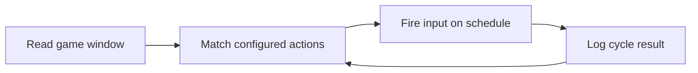

# lemon-sale-script-engine

*A standalone Windows companion for players who want a steadier, more predictable Sell Lemons run.*

## What this is

**What this is NOT**: lemon-sale-script-engine is not a modified game client, not a save editor, and not something that rewrites the rules of the game you're playing. It doesn't touch anything server-side, and it doesn't promise infinite currency or instant progression.

What it actually is: a Sell Lemons Script runner — a small Windows application that automates the repetitive parts of playing a lemon-stand style simulator (planting, harvesting, selling, upgrading) by reading the current game state and issuing the same inputs a player would issue manually, just on a schedule you control. It exists because grinding through hundreds of identical sale cycles by hand is tedious, and the game itself doesn't offer a built-in way to speed that loop up. The engine runs alongside the game window, not inside it, and every action it performs corresponds to something a human player could physically do with a mouse and keyboard.

  

The button above opens the project's landing page, where the current build is available to download.

## Who it is for

- **Long-session players** who want the harvesting-and-selling loop to keep running while they step away from the keyboard.
- **Simulator-genre regulars** who already know the Sell Lemons mechanics and just want fewer repetitive clicks.
- **Windows-only users** who prefer a lightweight desktop tool over browser extensions or in-game add-ons.
- **Players comparing automation approaches** who want to see how a rule-based script engine behaves before committing to a workflow.
- **Returning players** picking the game back up after a break and wanting to catch up efficiently.

## What you can do

- **Automate the sell cycle** — plant, wait, harvest, and sell in a configurable loop.
- **Set timing intervals** so actions match your game's actual cooldowns instead of guessing.
- **Queue upgrade purchases** once a target currency threshold is reached.
- **Pause and resume instantly** with a single hotkey, without closing the tool.
- **Run in the background** while you do something else on the same machine.
- **Adjust click regions** if your game window is resized or moved.
- **Save named profiles** for different farm layouts or play sessions.
- **View a simple run log** showing what the engine executed and when.

## Getting started

1. Open the landing page using the download link above.
2. Download the current Windows build (no installer required).
3. Extract the folder to any location on your drive.
4. Launch the executable, then open the Sell Lemons game window alongside it.
5. Set your interval and click region, then start the run.

## Requirements

- Windows 10 or Windows 11 (64-bit).
- No separate runtime, toolchain, or build step — it's a standalone executable.
- Enough screen space to keep the game window visible while the engine runs.
- Local administrator rights are not required for normal use.

## How it works

1. The engine reads the position and state of the game window you point it at.
2. It maps your configured actions (plant, harvest, sell, upgrade) to specific screen coordinates.
3. A timing loop fires those actions in sequence, respecting the intervals you've set.
4. Each cycle result is written to the run log so you can confirm nothing was missed.
5. The loop continues until you pause it or close the application.

## FAQ

**Is this a Sell Lemons Script that works after game updates?**
Game updates can shift button positions or timing, which may require re-calibrating your click regions or intervals. Check the landing page for build notes when a game update lands.

**Does this modify game files?**
No. It doesn't read, write, or replace any game files. It only sends the same kind of input a mouse and keyboard would.

**Can I run it on Mac or Linux?**
Not currently. The engine is built and tested for Windows 10/11 only.

**Will my progress carry over normally?**
Yes — since the engine performs standard in-game actions, your account and save data behave exactly as they would from manual play.

**Why does the sell loop sometimes skip a cycle?**
Usually a mismatched click region or an interval set faster than the game's actual cooldown. Recalibrating the region settings resolves most of these cases.

## Troubleshooting

- **The engine clicks the wrong spot** — your game window was moved or resized after setup; re-select the click region.
- **Nothing happens when the run starts** — confirm the game window is focused and visible on screen, not minimized.
- **Actions fire too fast or too slow** — adjust the interval setting to match the game's actual animation and cooldown timing.
- **The application won't launch** — make sure the folder was fully extracted before running the executable, not opened from inside a compressed archive.

## License

Released under the [MIT License](LICENSE). This project is provided as-is, without warranty of any kind, and is not affiliated with or endorsed by the developers of the underlying game.

  

